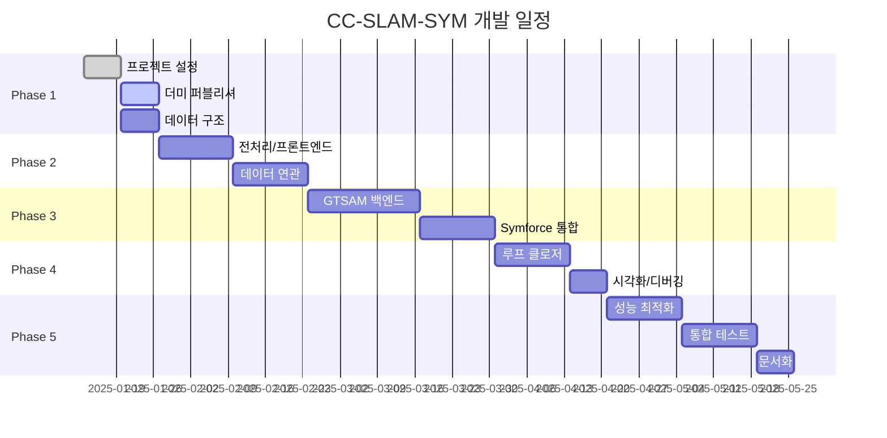

# CC-SLAM-SYM 개발 계획 상세

## 1. 개요

본 문서는 CC-SLAM-SYM 프로젝트의 상세 개발 계획을 담고 있습니다. 각 마일스톤별로 구체적인 작업 내용, 의존성, 테스트 계획을 포함합니다.

## 2. 개발 단계 개요

## 3. Phase 1: 기초 구축 (3주)

### 3.1 마일스톤 1: 프로젝트 설정 (1주)

**목표**: ROS2 패키지 구조 설정 및 기본 빌드 환경 구축

**작업 목록**:
- [ ] ROS2 패키지 생성 및 기본 구조 설정
  - `cc_slam_sym` 메인 패키지
  - `dummy_publisher` 서브 패키지
- [ ] CMakeLists.txt 및 package.xml 설정
  - GTSAM 4.3+ 의존성
  - Symforce 의존성
  - Eigen3, PCL, spdlog, yaml-cpp
- [ ] 기본 노드 템플릿 생성
  - `slam_node.cpp` 기본 구조
  - ROS2 파라미터 시스템 설정
- [ ] Docker 개발 환경 구축 (선택사항)
- [ ] CI/CD 파이프라인 설정 (GitHub Actions)

**테스트**: 
- 패키지 빌드 성공 확인
- 기본 노드 실행 테스트

### 3.2 마일스톤 2: 더미 퍼블리셔 구현 (1주)

**목표**: 시뮬레이션 테스트 환경 구축

**작업 목록**:
- [ ] 기존 `cone_definitions.py` 포팅 (변경 없음!)
- [ ] `simple_path_follower.py` 구현
  - 트랙 중앙선 계산
  - 단순 P 제어기
- [ ] `sensor_simulators.py` 구현
  - IMU 시뮬레이터 (6축)
  - GPS 시뮬레이터 (RTK 정밀도)
- [ ] `dummy_publisher_node.py` 통합
  - 모든 센서 데이터 동기화
  - 설정 파일 지원
- [ ] YAML 설정 파일 작성

**테스트**:
- 시나리오 1, 2 동작 확인
- 발행 주파수 검증
- RViz2 시각화 확인

### 3.3 마일스톤 3: 데이터 구조 정의 (1주)

**목표**: 핵심 데이터 구조 구현 및 인터페이스 정의

**작업 목록**:
- [ ] 기본 데이터 구조 구현
  - `ConeCluster`, `Landmark`, `Keyframe`
- [ ] GTSAM 관련 구조 구현
  - `SlamFactorGraph` 클래스
  - Noise Models
- [ ] ROS2 메시지 변환 유틸리티
- [ ] 데이터 직렬화/역직렬화
- [ ] 단위 테스트 작성

**테스트**:
- 각 데이터 구조 단위 테스트
- ROS2 메시지 변환 테스트

## 4. Phase 2: 프론트엔드 구현 (4주)

### 4.1 마일스톤 4: 전처리 및 프론트엔드 (2주)

**목표**: 센서 데이터 전처리 및 프론트엔드 추정 구현

**작업 목록**:

**Week 1 - 전처리**:
- [ ] 센서 데이터 수신 모듈
  - IMU 데이터 수신 및 버퍼링
  - GPS 데이터 수신 및 UTM 변환
  - 콘 클러스터 데이터 수신
- [ ] 시간 동기화 모듈
  - 타임스탬프 정렬
  - 보간 알고리즘
- [ ] 좌표계 변환
  - 센서 → 로봇 좌표계
  - 로봇 → 맵 좌표계

**Week 2 - 프론트엔드**:
- [ ] IMU 사전적분 구현
  - GTSAM PreintegratedImuMeasurements 활용
  - 바이어스 추정
- [ ] 키프레임 선정 로직
  - 거리/회전 기반 선정
  - 시간 기반 선정
- [ ] 초기 포즈 예측
  - 모션 모델 기반 예측

**테스트**:
- 센서 동기화 정확도 테스트
- IMU 적분 드리프트 분석
- 키프레임 선정 빈도 검증

### 4.2 마일스톤 5: 데이터 연관 (2주)

**목표**: 콘 관측과 랜드마크 매칭 알고리즘 구현

**작업 목록**:

**Week 1 - 기본 연관**:
- [ ] KD-Tree 기반 최근접 이웃 탐색
- [ ] 색상 기반 필터링
- [ ] 거리 기반 매칭
- [ ] 새 랜드마크 초기화

**Week 2 - 고급 기능**:
- [ ] 마할라노비스 거리 기반 매칭
- [ ] 아웃라이어 제거 (RANSAC)
- [ ] 다중 가설 추적 (선택사항)
- [ ] 연관 결과 검증

**테스트**:
- 매칭 정확도 테스트
- 오매칭률 분석
- 계산 시간 측정

## 5. Phase 3: 백엔드 최적화 (5주)

### 5.1 마일스톤 6: GTSAM 백엔드 구현 (3주)

**목표**: Factor Graph 기반 SLAM 백엔드 구현

**작업 목록**:

**Week 1 - Factor Graph 기초**:
- [ ] Factor Graph 구조 설계
- [ ] Prior Factor 구현
- [ ] Odometry Factor 구현
- [ ] 기본 최적화 테스트

**Week 2 - 센서 통합**:
- [ ] Landmark Factor 구현
  - 2D 투영 모델
  - 색상 정보 활용
- [ ] GPS Factor 구현
- [ ] IMU Factor 통합

**Week 3 - ISAM2 최적화**:
- [ ] ISAM2 증분 최적화 구현
- [ ] 고정 지연 스무더 (선택사항)
- [ ] 마지널라이제이션 전략
- [ ] 메모리 관리 최적화

**테스트**:
- 단일 팩터 테스트
- 전체 그래프 최적화 테스트
- 수렴성 분석

### 5.2 마일스톤 7: Symforce 통합 (2주)

**목표**: Symforce를 활용한 커스텀 팩터 구현

**작업 목록**:

**Week 1 - Symforce 설정**:
- [ ] Symforce 개발 환경 구축
- [ ] 심볼릭 변수 정의
- [ ] 커스텀 잔차 함수 구현
  - 콘 관측 모델
  - 특수 제약 조건

**Week 2 - 코드 생성 및 통합**:
- [ ] C++ 코드 자동 생성
- [ ] GTSAM 팩터로 래핑
- [ ] 성능 비교 (수동 vs 자동 미분)
- [ ] 최적화 파라미터 튜닝

**테스트**:
- 야코비안 정확도 검증
- 계산 속도 비교
- 수치 안정성 테스트

## 6. Phase 4: 고급 기능 (3주)

### 6.1 마일스톤 8: 루프 클로저 (2주)

**목표**: 루프 감지 및 클로저 구현

**작업 목록**:

**Week 1 - 루프 감지**:
- [ ] 공간 인덱싱 (R-tree)
- [ ] 랜드마크 기반 장소 인식
- [ ] 기하학적 검증
- [ ] 루프 후보 선별

**Week 2 - 루프 클로저**:
- [ ] 상대 포즈 계산
- [ ] Loop Factor 추가
- [ ] 그래프 재최적화
- [ ] 맵 일관성 유지

**테스트**:
- 루프 감지율 테스트
- 오검출률 분석
- 맵 드리프트 개선 측정

### 6.2 마일스톤 9: 시각화 및 디버깅 (1주)

**목표**: RViz2 시각화 및 디버깅 도구 개발

**작업 목록**:
- [ ] RViz2 플러그인 개발
  - 맵 시각화
  - 궤적 표시
  - 불확실성 타원
- [ ] 실시간 통계 표시
- [ ] 디버깅 마커
- [ ] 로깅 시스템 구축

**테스트**:
- 시각화 성능 테스트
- UI 사용성 검증

## 7. Phase 5: 최종 단계 (5주)

### 7.1 마일스톤 10: 성능 최적화 (2주)

**목표**: 실시간 성능 달성을 위한 최적화

**작업 목록**:

**Week 1 - 프로파일링**:
- [ ] CPU 프로파일링 (perf, valgrind)
- [ ] 메모리 프로파일링
- [ ] 병목 구간 식별
- [ ] 알고리즘 복잡도 분석

**Week 2 - 최적화**:
- [ ] 병렬 처리 구현 (OpenMP, TBB)
- [ ] 캐시 최적화
- [ ] 불필요한 계산 제거
- [ ] 파라미터 자동 튜닝

**테스트**:
- 처리 속도 벤치마크
- 메모리 사용량 측정
- 실시간성 검증

### 7.2 마일스톤 11: 통합 테스트 (2주)

**목표**: 전체 시스템 검증 및 실제 데이터 테스트

**작업 목록**:

**Week 1 - 시뮬레이션 테스트**:
- [ ] 더미 퍼블리셔 전체 시나리오 테스트
- [ ] 장시간 실행 안정성
- [ ] 에러 케이스 처리
- [ ] 성능 지표 수집

**Week 2 - 실제 데이터 테스트**:
- [ ] rosbag 데이터 처리
- [ ] 다양한 환경 조건 테스트
- [ ] Ground Truth 대비 정확도 평가
- [ ] 시스템 한계 분석

### 7.3 마일스톤 12: 문서화 (1주)

**목표**: 완전한 프로젝트 문서화

**작업 목록**:
- [ ] 사용자 매뉴얼 작성
- [ ] API 문서 생성 (Doxygen)
- [ ] 튜토리얼 및 예제 코드
- [ ] 트러블슈팅 가이드
- [ ] 성능 벤치마크 리포트

## 8. 위험 관리

### 8.1 기술적 위험

| 위험 요소 | 확률 | 영향 | 대응 방안 |
|-----------|------|------|-----------|
| GTSAM/Symforce 통합 이슈 | 중 | 높음 | 조기 프로토타입, 대안 준비 |
| 실시간 성능 미달 | 중 | 높음 | 단계적 최적화, GPU 가속 고려 |
| 센서 동기화 문제 | 낮 | 중 | 강건한 보간 알고리즘 |
| 메모리 부족 | 낮 | 중 | 슬라이딩 윈도우, 맵 압축 |

### 8.2 일정 위험

- **버퍼 시간**: 각 마일스톤에 20% 버퍼 포함
- **우선순위**: 핵심 기능 우선 구현
- **반복 개발**: 2주 스프린트로 진행

## 9. 품질 보증

### 9.1 코드 품질

- **코딩 표준**: Google C++ Style Guide
- **코드 리뷰**: 모든 PR에 대해 필수
- **정적 분석**: clang-tidy, cppcheck
- **테스트 커버리지**: 80% 이상 목표

### 9.2 테스트 전략

- **단위 테스트**: Google Test 사용
- **통합 테스트**: ROS2 테스트 프레임워크
- **시스템 테스트**: 시나리오 기반 검증
- **성능 테스트**: 자동화된 벤치마크

## 10. 도구 및 환경

### 10.1 개발 도구

- **IDE**: VSCode + ROS2 확장
- **빌드**: CMake 3.16+, colcon
- **디버거**: GDB, ROS2 디버깅 도구
- **프로파일러**: perf, valgrind, gperftools

### 10.2 협업 도구

- **버전 관리**: Git + GitHub
- **이슈 추적**: GitHub Issues
- **프로젝트 관리**: GitHub Projects (칸반)
- **문서**: Markdown + Doxygen
- **CI/CD**: GitHub Actions

## 11. 완료 기준

각 마일스톤의 완료 기준:
- 모든 작업 항목 완료
- 단위 테스트 통과
- 코드 리뷰 승인
- 문서 업데이트
- 성능 목표 달성